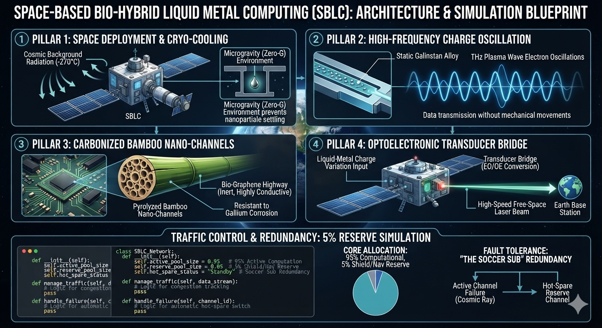

# bio_chip_power



A theoretical blueprint and Python simulation for a **Space-Based Bio-Hybrid Liquid Metal Computing (SBLC)** system. This architecture shifts the hardware computing environment to deep space to eliminate traditional silicon physical bottlenecks (overheating, traffic jams, quantum leakage).

## 🚀 System Architecture Overview
The SBLC system relies on four primary design pillars:
1. **Space Deployment & Cryo-Cooling:** Operates in microgravity (Zero-G) to prevent magnetic nanoparticle settling. It utilizes cosmic cooling (-270°C) for natural heat dissipation.
2. **High-Frequency Charge Oscillation:** Semi-liquid Galinstan alloy remains completely static. Data transmits via plasma wave electron oscillations at THz scales, eliminating mechanical delay and friction.
3. **Carbonized Bamboo Nano-Channels:** Circuits are built using natural bamboo channels processed via pyrolysis (oxygen-free baking at 1000°C) into an inert, highly conductive bio-graphene highway resistant to Gallium corrosion.
4. **Optoelectronic Transducer Bridge:** Translates localized liquid-metal charge variations into high-speed free-space lasers to beam data back to Earth base stations.

## 🛡️ Traffic Control & Redundancy (The 5% Reserve)
This repository includes a Python simulation modeling the core queuing system:
* **95% Active Computational Pool:** Handles regular data streams.
* **5% Shield & Navigation Reserve:** Dedicated management cores tracking network congestion.
* **Hot-Spare Redundancy ("The Soccer Sub"):** Automatically switches data streams to a healthy reserve channel if an active channel experiences a failure (e.g., from cosmic ray distortion).


## 🤝 Co-existence Strategy: Respecting the Silicon King

**Important Note on Architectural Intent:** 
This project is NOT a replacement for traditional silicon chip technology. Silicon remains the undisputed king ("ông trùm") of the computing world, powering global infrastructure with unmatched maturity and scale. 

However, as silicon approaches physical bottlenecks (thermal limits, quantum tunneling) that cannot be easily unknotted in the short term, the SBLC architecture proposes a **co-existence framework**. 

Instead of re-engineering the internal micro-components of established silicon chips, this project introduces an **external, bio-hybrid environment layer** that runs alongside traditional hardware. By combining the blistering processing speed of localized silicon with the ultra-cool, zero-gravity fluidic oscillation network of SBLC, we achieve a hybrid system that honors existing technology while opening an alternative, complementary path forward.


## 💻 Simulation Setup
Run the Python script to see the dynamic routing, error-handling, and hot-spare swap logic in action:

```bash
python simulation.py
```
